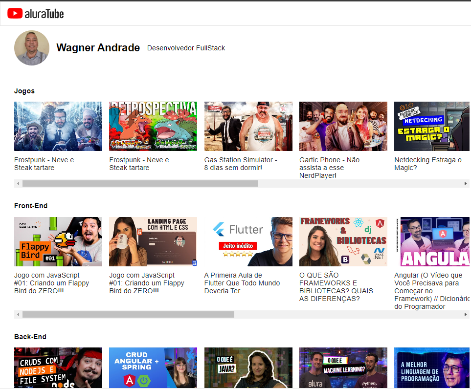

# 📂 React AluraTube
> Frontend da aplicação 📸

  

 

## 📃 Descrição do projeto
Desenvolvido durante participação da Imersão React na Alura.

 

## 🔖 Layout
Segue abaixo o layout deste projeto:

- [Figma](https://www.figma.com/file/1acrju7CLwHkSh6e7xEk9h/Aluratube?t=OJ2eMKroGbD0jo6r-6)

 

## 🛠️ Instalação
Siga esses passos para instalar o repositório na sua máquina:

1. Dê um git clone no repositório;
2. Rode `npm i` para instalar as dependências.
3. Rode `npm run dev` para iniciar o servidor de desenvolvimento.
4. Acesse a url local `http://localhost:3000/`

 

## 🚀 Tecnologias
  - JavaScript
  - DOM
  - Node
  - NPM
  - Supabase
  - Next
  - React
  - React DOM
  - Styled Components
  - Media Queries

 

## 💻 Projeto

[Acessar o projeto](https://aluratube-tau-blue.vercel.app/)

---
## 📧 Contato
wsawebmaster@yahoo.com.br
